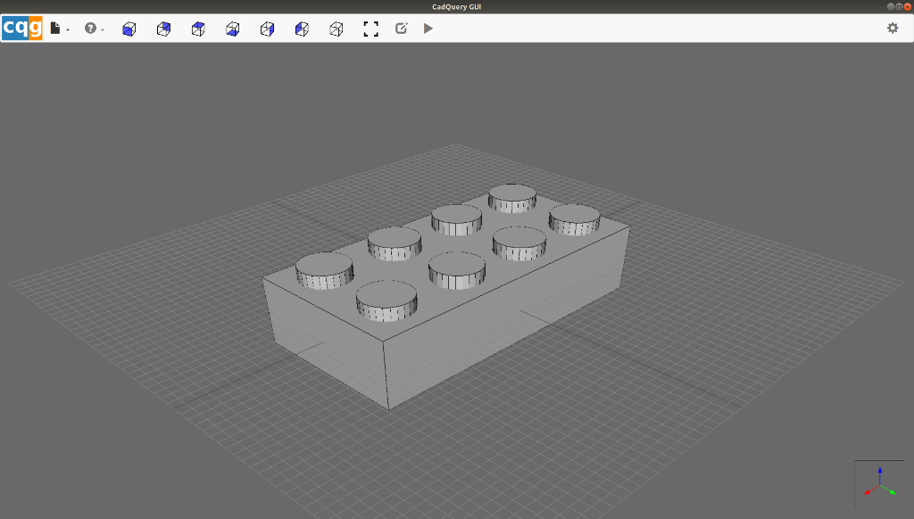

# cadquery-gui (cqg)
An Electron-based CAD GUI built for [CadQuery](https://github.com/dcowden/cadquery/blob/master/README.md).

***Note: This software is in alpha and is seeing breaking changes frequently. It is not ready for production use.***



## Prerequisites
1. Install npm
2. Install FreeCAD (>=0.16)
3. Install the latest version of CadQuery from the GitHub repo.
```
pip install git+https://github.com/dcowden/cadquery.git
```

## Install The Latest Development Version
The latest version can be cloned directly from this GitHub repo.
```
git clone https://github.com/jmwright/cadquery-gui.git
cd cadquery-gui/
npm install
```

## Run The Latest Development Version
```
npm start
```
